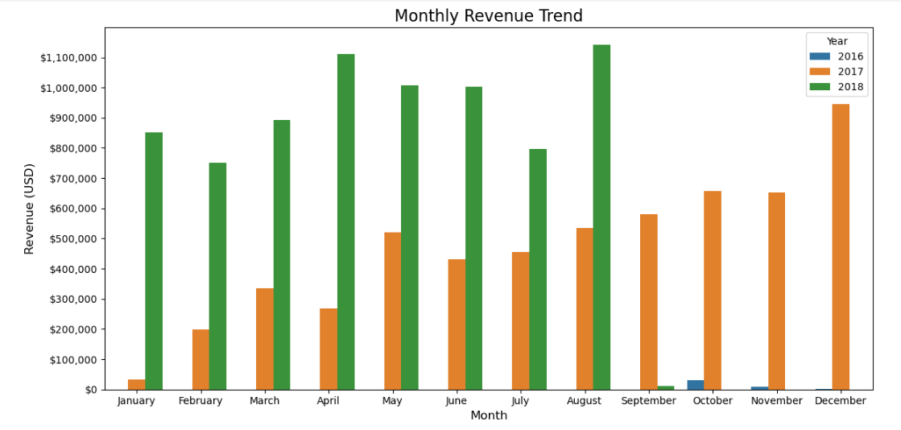
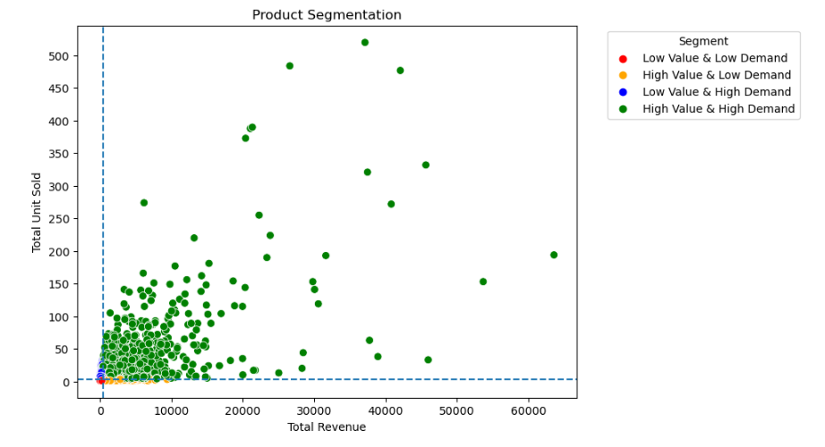
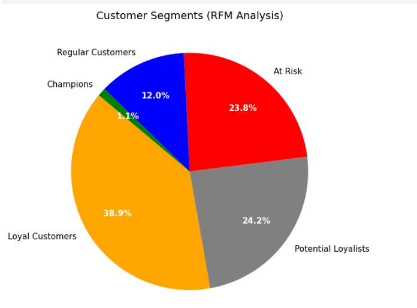

# Olist E-Commerce Analytics Project

# Project Overview

This portfolio project demonstrates an end-to-end analytics workflow using **SQL, Python, and Tableau** on the Olist e-commerce dataset. The project is intentionally structured in three stages to show progression from data extraction to advanced analytics and business intelligence dashboarding.

---

# Project Stages

## 1. SQL Analytics Stage (Data Extraction & Business Analysis)

### Objective

Use SQL for:

* relational data exploration
* business analysis
* KPI generation
* operational insights
* analytical querying on a multi-table e-commerce schema

### Skills Demonstrated

* Complex Joins
* CTEs
* Window Functions
* Aggregations
* Subqueries
* Customer & Product Segmentation
* Delivery Performance Analysis

---

## Key Business Questions Answered

### Revenue Trend Analysis

* How does revenue trend monthly and yearly?
* Which periods drive peak sales?

### Customer Analysis

* One-time vs repeat customer contribution
* Average order value by customer type
* Customer purchase behavior

### Product Analysis

* High-demand products
* High-value vs low-demand products
* Category-level performance

### Logistics Analysis

* Delivery performance
* Estimated vs actual delivery timing
* Geographic delivery patterns

---

## Sample Advanced SQL Queries Used

### 1. Monthly Revenue Trend with Year Comparison

```sql
SELECT
    YEAR(order_purchase_timestamp) AS year,
    MONTHNAME(order_purchase_timestamp) AS month_name,
    SUM(price) AS revenue
FROM orders o
JOIN order_items oi
ON o.order_id = oi.order_id
GROUP BY 1,2
ORDER BY YEAR(order_purchase_timestamp),
MONTH(order_purchase_timestamp);
```

### Insight

Used for time-series revenue trend analysis and seasonality detection.

---

### 2. Customer Segmentation (One-Time vs Repeat)

```sql
WITH customer_orders AS (
SELECT
customer_unique_id,
COUNT(DISTINCT o.order_id) total_orders,
SUM(price) total_revenue
FROM customers c
JOIN orders o
ON c.customer_id=o.customer_id
JOIN order_items oi
ON o.order_id=oi.order_id
GROUP BY customer_unique_id
)

SELECT
CASE
WHEN total_orders=1 THEN 'One Time'
ELSE 'Repeat'
END customer_status,
COUNT(*) customers,
SUM(total_revenue) revenue,
AVG(total_revenue/total_orders) avg_order_value
FROM customer_orders
GROUP BY customer_status;
```

### Insight

Used to quantify customer retention behavior and revenue concentration.

---

### 3. Product Performance Segmentation with Window Functions

```sql
WITH product_perf AS (
SELECT
product_id,
COUNT(*) total_orders,
SUM(price) total_revenue
FROM order_items
GROUP BY product_id
)

SELECT
product_id,
total_orders,
total_revenue,
NTILE(4) OVER(
ORDER BY total_revenue DESC
) revenue_quartile,
RANK() OVER(
ORDER BY total_revenue DESC
) revenue_rank
FROM product_perf;
```

### Insight

Used for identifying high-value products and ranking product performance.

---

## SQL Stage Key Findings

* Credit cards dominate payment usage.
* One-time customers contribute majority revenue.
* Revenue shows clear seasonal peaks.
* Delivery estimates are conservative relative to actual delivery.
* Product performance is concentrated among a subset of SKUs.

---

---

# 2. Python Analytics Stage (Pandas + Seaborn + Matplotlib)

## Objective

Extend SQL analysis into deeper exploratory analysis, segmentation, statistical summaries and visual storytelling using Python.

---

## Tools Used

* Python
* Pandas
* Matplotlib
* Seaborn
* SQLAlchemy

---

## Skills Demonstrated

* Data manipulation with Pandas
* Feature engineering
* Customer RFM analysis
* Product segmentation
* Statistical distributions
* Advanced visualization
* Sentiment analysis preparation

---

# Sample Pandas Analysis Code

## 1. Monthly Revenue Trend

```python
monthly_revenue=(
merged_orders
.groupby(["year","month_name"])
.agg(
revenue=("price","sum")
)
.reset_index()
)
```

### What it does

* Groups data by year and month
* Aggregates revenue
* Creates trend-ready dataset for visualization

---

## 2. Customer Revenue Segmentation

```python
customer_status_summary=(
customer_summary
.groupby("customer_status")
.agg(
 total_orders=("order_id","count"),
 total_revenue=("price","sum")
)
.reset_index()
)

customer_status_summary[
"revenue_percentage"
]=(
customer_status_summary[
"total_revenue"
]/
customer_status_summary[
"total_revenue"
].sum()
)*100
```

### What it does

Calculates:

* revenue contribution
* order volume
* customer segment shares

---

## 3. Product Segmentation Logic

```python
revenue_threshold=product_summary[
"total_revenue"
].mean()

units_threshold=product_summary[
"total_orders"
].mean()

def segment(row):
    if row["total_revenue"]>=revenue_threshold and row["total_orders"]>=units_threshold:
        return "High Value & High Demand"
    elif row["total_revenue"]>=revenue_threshold:
        return "High Value & Low Demand"
    elif row["total_orders"]>=units_threshold:
        return "Low Value & High Demand"
    else:
        return "Low Value & Low Demand"

product_summary[
"segment"
]=product_summary.apply(segment,axis=1)
```

### What it does

Segments products into performance quadrants.

---

# Sample Visualization Code

## Monthly Revenue Trend (Matplotlib + Seaborn)

```python
fig, ax = plt.subplots(figsize=(12,6))

sns.barplot(
    x="month_name",
    y="price",
    hue="year",
    data=monthly_revenue,
    ax=ax
)

ax.set_title("Monthly Revenue Trend")
ax.set_xlabel("Month")
ax.set_ylabel("Revenue (USD)")

plt.show()
```

### Chart Output

```markdown

```

---

## Product Segmentation Scatter Plot

```python
fig, ax = plt.subplots(figsize=(8,6))

sns.scatterplot(
 data=product_summary,
 x="total_revenue",
 y="total_orders",
 hue="segment",
 ax=ax
)

ax.set_title("Product Segmentation")
plt.show()
```

### Chart Output

(Add chart image here)

```markdown

```

---

## Customer RFM Segment Distribution

```python
fig, ax = plt.subplots(figsize=(7,7))

ax.pie(
 segment_counts.values,
 labels=segment_counts.index,
 autopct='%1.1f%%'
)

ax.set_title(
"Customer Segments (RFM Analysis)"
)

plt.show()
```

### Chart Output

(Add chart image here)

```markdown

```

---

## Python Stage Key Findings

### Customer Insights

* One-time buyers contribute most revenue.
* Repeat customers show lower AOV but stronger retention potential.

### Product Insights

* Revenue is concentrated in a few categories.
* High-value products are not always high-demand.

### RFM Insights

* Customer base contains champions, loyal customers and at-risk segments.
* Retention opportunities identified.

### Operational Insights

* Delivery performance supports strong fulfillment reliability.

---

---

# 3. Tableau Dashboard Stage (In Progress)

## Objective

Transform SQL and Python insights into interactive business intelligence dashboards.

Planned dashboard modules:

## Executive Dashboard

* Revenue KPIs
* Sales trends
* AOV
* Customer metrics

## Product Dashboard

* Product/category performance
* Demand vs value analysis
* Contribution analysis

## Customer Dashboard

* RFM segmentation
* Customer cohorts
* Retention patterns

## Operations Dashboard

* Delivery performance
* Geographic analysis
* Logistics monitoring

---

## Advanced Tableau Concepts Planned

This stage will include:

* Actions
* Sets
* Parameters
* Bins and Histograms
* Groups and Clusters
* Table Calculations
* LOD Expressions
* Window Functions
* Calculated Fields
* Interactive Dashboards
* Storytelling Dashboards

---

## Tableau Stage Status

🚧 In Progress

This section will be expanded once dashboard development is completed.

---

---

# Repository Structure

```text
olist-ecommerce-project/
│
├── sql/
│   └── analysis_queries.sql
│
├── notebooks/
│   └── python_analysis.ipynb
│
├── reports/
│   └── visuals/
│       ├── monthly_revenue_trend.png
│       ├── product_segmentation.png
│       └── rfm_segments.png
│
├── dashboards/
│   ├── powerbi/
│   └── tableau/
│
└── README.md
```

---

# Key Technologies

* MySQL
* Python
* Pandas
* Matplotlib
* Seaborn
* Tableau

---

# Future Enhancements

* Review sentiment analysis (NLP)
* Forecasting models
* Streamlit deployment
* Tableau public dashboard publication

---

# Portfolio Value

This project demonstrates:

* Data Analytics
* Business Intelligence
* SQL Development
* Python Analytics
* Dashboard Engineering
* End-to-End Analytical Thinking
